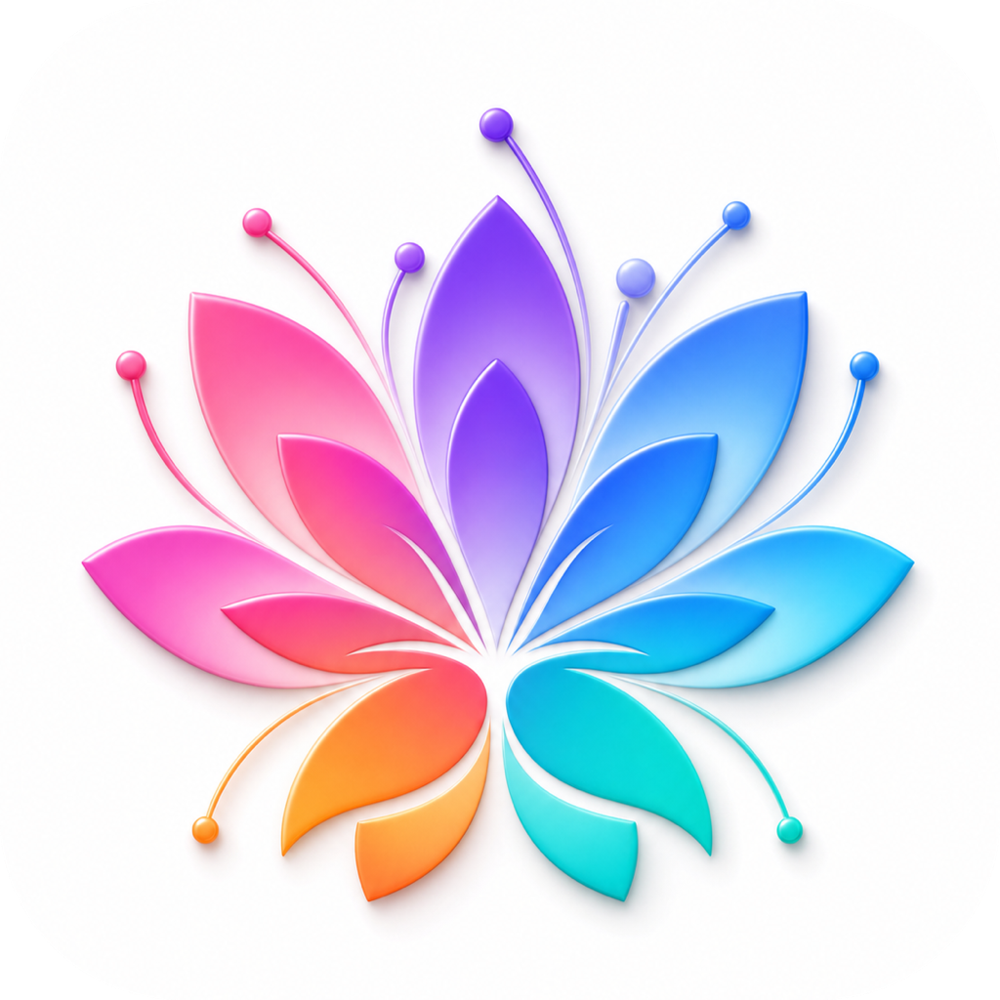

<div align="center">
  
  <h1>Bloom Canvas / 生花</h1>
  <p>面向 AI 图像创作、提示词优化和结构化 Logo 探索的开源桌面工作台。</p>

  <p>
    <a href="README.md">English</a> |
    <a href="README.zh-CN.md">简体中文</a>
  </p>

  <p>
    <a href="LICENSE"></a>
    
    
    
  </p>
</div>

Bloom Canvas（生花）将提示词、参考图和品牌简报组织成清晰的图像生成流程。应用在本地运行，可连接 OpenAI-compatible Provider，并将 Provider 设置、生成历史和图片资源保存在用户设备上。

> [!NOTE]
> Bloom Canvas 正在持续开发。目前应用界面以简体中文为主，英文国际化已经列入后续计划。项目暂未提供正式安装包，需要从源码运行。

## 功能特性

- **通用图像创作：** 支持文生图，也可以添加一张或多张参考图继续修改。
- **可选提示词优化：** 使用已配置的文字模型优化提示词，同时保留并展示用户原文。
- **结构化 Logo 工作流：** 填写品牌简报、探索多个视觉方向、预览提示词、继续修改候选结果并导出初稿。
- **灵活配置 Provider：** 可自定义 OpenAI-compatible 服务的 Base URL、API Key、图像模型和文字模型。
- **本地优先：** 图片、缩略图、Provider 配置和生成历史均保存在本地。
- **结果管理：** 支持搜索历史、重试失败任务、以结果图继续创作，并导出 PNG、JPEG 或 WebP 图片。

## 环境要求

- macOS、Windows 或 Linux
- [Node.js](https://nodejs.org/) `^20.19.0` 或 `>=22.12.0`
- [pnpm](https://pnpm.io/) 11
- OpenAI-compatible 图像服务的 API Key

## 快速开始

```bash
git clone https://github.com/def-peter/bloom-canvas.git
cd bloom-canvas
corepack enable
pnpm install
pnpm dev
```

启动应用后，打开「Provider 设置」并填写以下内容：

| 设置项   | 用途                               | 示例                        |
| -------- | ---------------------------------- | --------------------------- |
| 名称     | Provider 的本地显示名称            | `OpenAI`                    |
| Base URL | OpenAI-compatible API 基础地址     | `https://api.openai.com/v1` |
| API Key  | 仅发送给已配置 Provider 的凭据     | `sk-...`                    |
| 图像模型 | 用于生成和编辑图片的模型           | `gpt-image-2`               |
| 文字模型 | 用于提示词优化和 AI 辅助流程的模型 | 支持 Responses API 的模型   |

Provider 必须支持 `POST /images/generations`；如需使用参考图编辑，还必须支持 `POST /images/edits`。提示词优化需要 `POST /responses`，AI 辅助流程也可能使用该接口。图片响应需要包含 OpenAI-compatible `b64_json` 格式的 Base64 数据。

## 本地开发

| 命令               | 说明                                    |
| ------------------ | --------------------------------------- |
| `pnpm dev`         | 以开发模式启动 Electron 应用            |
| `pnpm test:run`    | 单次运行完整测试                        |
| `pnpm lint`        | 运行 ESLint                             |
| `pnpm typecheck`   | 检查 Main、Preload 和 Renderer 代码类型 |
| `pnpm build`       | 类型检查并生成生产构建                  |
| `pnpm build:mac`   | 构建 macOS 安装包                       |
| `pnpm build:win`   | 构建 Windows 安装包                     |
| `pnpm build:linux` | 构建 Linux 安装包                       |

项目使用 Electron、React、TypeScript、Ant Design、electron-vite、Vitest 和 Sharp。Renderer 通过类型化的 Preload API 通信；Provider 请求、凭据和文件操作均由 Electron Main 进程处理。

## 本地数据与隐私

Bloom Canvas 不要求注册账号，也不依赖 Bloom Canvas 云端服务。应用元数据和图片保存在 Electron 的用户应用数据目录下，具体位于 `BloomCanvasData`。API Key 使用本地生成的密钥加密保存，不会写入普通 Provider 配置。

发起图片生成、图片编辑、提示词优化或策略辅助时，应用会将提示词和相关图片发送给用户配置的 Provider。处理敏感资料前，请先阅读对应 Provider 的隐私和数据保留政策。

## 项目状态

当前优先事项包括：

- 英文和简体中文界面国际化
- 完善策略驱动的 Logo 工作流
- 应用打包、签名和可下载版本
- Provider 兼容性与贡献流程文档

Bloom Canvas 用于探索和优化 Logo 创意方向，不能代替专业矢量制版、字体设计、商标检索或法律审查。将 AI 生成的 Logo 初稿用于商业场景前，请完成必要的验证。

## 参与贡献

欢迎提交 Issue 和 Pull Request。准备开发大型功能前，建议先创建 Issue，讨论范围和产品方向。提交改动前请运行：

```bash
pnpm test:run
pnpm lint
pnpm typecheck
```

## 许可证

Bloom Canvas 使用 [MIT License](LICENSE) 开源。
