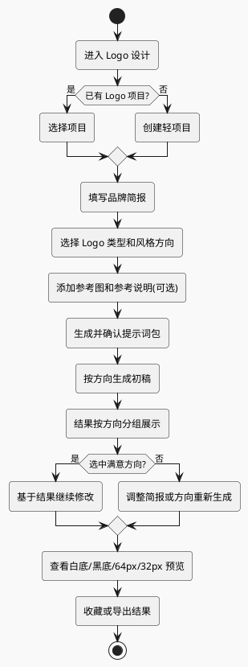

# BloomCanvas / 生花 Logo 设计专题规格

日期：2026-07-09

## 1. 定位

Logo 设计专题定位为：围绕一个品牌简报进行多方向 Logo 初稿探索的轻项目工作流。

它不是通用生图的一个提示词模板，也不是完整品牌 VI 系统。首版目标是帮助用户把品牌信息整理成可执行的 Logo 设计简报，并生成多个简洁、可缩放、可继续修改的 Logo 方向。

核心判断：

- 通用创作仍然不使用项目制。
- Logo 设计使用轻项目，因为 Logo 天然围绕同一个品牌反复迭代。
- Logo 初稿优先追求清晰、简洁、可缩放、可识别，而不是复杂画面效果。
- 参考图仍由提示词决定参考方式，不固定成“风格参考/颜色参考/构图参考”等强分类。

## 2. 人类 Logo 设计流程

真实设计师做 Logo 时，不会直接从一句提示词开始画最终稿，通常会经历以下流程：

| 阶段 | 设计师在做什么 | 需要的信息 |
| --- | --- | --- |
| 设计简报 | 搞清楚品牌是谁、给谁看、想传达什么 | 品牌名、行业、业务、目标用户、品牌气质 |
| 品牌定位 | 找差异点，避免做成行业通用图标 | 核心卖点、竞品、禁忌、希望被如何记住 |
| 视觉方向 | 定风格路线，而不是直接画最终图 | 极简、科技、亲和、高端、复古、东方等方向 |
| 概念草图 | 探索符号、字体、构图和抽象概念 | 图形元素、字母缩写、象征物、抽象关键词 |
| 数字化方案 | 做 3-5 个可比较的初稿 | 颜色、字体、图形比例、横版/竖版 |
| 应用验证 | 检查小尺寸、黑白、深浅背景是否成立 | App 图标、网站、包装、门店、社媒头像等场景 |
| 精修交付 | 统一比例、色值、版本和文件格式 | PNG、SVG、PDF、标准色、留白、安全区 |

BloomCanvas 首版将这个流程压缩为 6 步：

1. 品牌简报
2. 方向选择
3. 生成前提示词确认
4. 初稿探索
5. 选择并继续修改
6. 可用性检查

## 3. 产品流程



### 3.1 创建 Logo 轻项目

一个 Logo 项目代表一个品牌的探索任务。项目保存品牌简报、参考图、生成记录和结果选择。

不做复杂项目管理，不做文件夹层级、团队协作、审批状态、客户交付流程。

### 3.2 补充设计简报

右侧创作面板从通用提示词面板切换为 Logo 表单。用户填写结构化信息，系统负责把这些信息编译成适合图像模型理解的提示词。

用户仍可以补充自由描述，但自由描述是补充，不替代结构化字段。

### 3.3 多方向初稿探索

用户最多选择 4 个风格方向。默认选中 3 个方向：

- 现代极简
- 图形符号
- 字体标

每个方向默认生成 1 张，用户可以改成每个方向 2 张。结果区按方向分组展示，避免所有图片混在一个普通网格里。

### 3.4 生成前提示词确认

表单和流程走完之后，图片生成之前的最终产物不是图片请求本身，而是一份可审查的 Logo 提示词包。

提示词包由两层组成：

```text
LogoPromptPack
├─ basePrompt
│  ├─ 品牌简报
│  ├─ Logo 通用质量硬规则
│  ├─ 颜色、禁用元素、使用场景
│  └─ 参考图说明
└─ directionPrompts[]
   ├─ 现代极简方向提示词
   ├─ 图形符号方向提示词
   └─ 字体标方向提示词
```

用户选择多个风格方向时，系统应生成一个公共 `basePrompt` 和多份 `directionPrompts`。每个方向最终使用的是 `basePrompt + directionPrompt` 合成后的最终提示词。

界面上应提供提示词预览：

- 默认展示摘要，避免让主流程显得很重。
- 支持展开查看完整提示词。
- 支持用户手动编辑最终提示词。
- 点击 `生成 Logo 初稿` 时，使用用户确认后的提示词，而不是重新隐式改写。

保存生成记录时必须保存当时实际使用的最终提示词，方便后续复盘、重试和继续修改。

### 3.5 选择方案继续修改

用户可以选中某张结果继续修改。继续修改时，该结果会作为参考图加入当前 Logo 项目，用户输入修改要求，例如：

- 更简洁
- 换成蓝色
- 去掉细碎装饰
- 保留图形，弱化文字
- 只做图形标
- 加强科技感，但不要复杂线条

### 3.6 Logo 可用性检查

Logo 结果必须提供检查视图：

- 原图预览
- 白底预览
- 黑底预览
- 64px 小尺寸预览
- 32px 小尺寸预览

检查视图不需要调用模型重新生成，只需要在前端用不同背景和固定尺寸展示同一张结果图。首版目标是让用户快速识别“这张图缩小后是否还清楚”。

## 4. Logo 设计输入要素

### 4.1 基础信息

| 字段 | 是否首版需要 | 说明 |
| --- | --- | --- |
| 品牌名 | 必填 | Logo 设计核心输入 |
| 英文名/简称 | 可选 | 用于字母标、英文标或国际化品牌 |
| Slogan | 可选 | 不强制，避免 Logo 文字过多 |
| 行业 | 必填 | 影响符号、风格和禁忌 |
| 业务描述 | 必填 | 防止只按行业模板生成 |
| 目标用户 | 建议填写 | 决定专业、亲和、年轻、高端等表达 |

### 4.2 品牌气质

| 字段 | 是否首版需要 | 说明 |
| --- | --- | --- |
| 品牌关键词 | 必填 | 建议 2-6 个，例如可靠、轻盈、东方、科技、自然 |
| 核心差异点 | 可选 | 帮助避免行业通用图标 |
| 想避免的感觉/元素 | 可选 | 例如不要花、不要动物、不要渐变、不要复杂线条 |
| 颜色偏好 | 可选 | 喜欢的颜色、禁用颜色、是否允许黑白 |

### 4.3 Logo 方向

| 字段 | 是否首版需要 | 说明 |
| --- | --- | --- |
| Logo 类型 | 必填 | 图形标、字体标、组合标、字母标、徽章标 |
| 风格方向 | 必填 | 最多 4 个，默认 3 个 |
| 使用场景 | 建议填写 | App 图标、网站、包装、门店、社媒头像、电商等 |

### 4.4 参考材料

| 字段 | 是否首版需要 | 说明 |
| --- | --- | --- |
| 参考图 | 可选 | 可以是草图、竞品、风格参考、已有 Logo |
| 参考说明 | 可选 | 用户描述要参考什么、不要参考什么 |

参考图语义仍由用户提示词决定。系统不在首版强行要求用户为每张图标注“颜色参考/构图参考/风格参考”。

## 5. Logo 质量硬规则

Logo 专题必须默认注入质量约束。任何风格都不能突破以下原则：

| 原则 | 要求 |
| --- | --- |
| 简洁优先 | 1 个核心图形概念，最多 1-2 个主要视觉元素 |
| 可缩放 | 缩小到 64px 和 32px 仍能识别 |
| 轮廓清晰 | 图形剪影明确，避免依赖微小细节 |
| 避免细碎 | 不要复杂纹理、细线、小装饰、复杂背景 |
| 避免廉价感 | 少用 3D、强渐变、阴影、金属质感、光效堆叠 |
| 可单色 | 黑白或单色版本也应该成立 |
| 构图克制 | 留白足够，不拥挤，不做海报式画面 |

这些约束是硬规则，不是用户可选风格。即使用户选择国潮、奢华、科技、复古，也要把风格控制在简洁 Logo 语境里。

## 6. 风格方向目录

首版提供固定风格方向目录，并允许后续扩展：

| 方向 | 说明 | 默认 |
| --- | --- | --- |
| 现代极简 | 清晰几何、留白充足、符号克制 | 是 |
| 图形符号 | 抽象或半抽象图形标，强调可识别轮廓 | 是 |
| 字体标 | 以品牌文字为主体，强调字形气质 | 是 |
| 字母标 | 使用英文名、简称或首字母构成标识 | 否 |
| 徽章式 | 圆形、盾形或印章感结构，但必须简化 | 否 |
| 科技感 | 几何、网格、未来感，但避免复杂线路 | 否 |
| 亲和圆润 | 更柔和、友好、易亲近 | 否 |
| 东方现代 | 东方气质与现代几何结合，避免复杂传统纹样 | 否 |
| 高端克制 | 高级、留白、低饱和，避免金属光效堆叠 | 否 |

不提供以下容易导致低质结果的方向：

- 超写实 3D Logo
- 复杂插画 Logo
- 赛博细节堆叠
- 光效海报风
- 吉祥物海报风

## 7. 提示词编译规则

Logo 专题不直接把表单字段拼成一句中文提示词，也不应该在用户点击生成时隐藏式临时拼接。它应先把结构化表单编译成可预览、可编辑、可保存的提示词包。每个风格方向生成一份独立方向提示词。

提示词结构：

```text
任务目标
- 为指定品牌生成 Logo 初稿
- 当前方向名称和方向说明

品牌简报
- 品牌名
- 英文名/简称
- 行业
- 业务描述
- 目标用户
- 品牌关键词
- 核心差异点

Logo 约束
- Logo 类型
- 颜色偏好
- 禁止元素
- 使用场景

质量硬规则
- simple, scalable, clean vector-like logo
- clear silhouette
- minimal details
- works at 64px and 32px
- no complex texture
- no tiny decorative elements
- no photorealistic scene
- no poster background

输出要求
- centered logo composition
- clean plain background
- no mockup
- no excessive shadows or gradients
```

如果用户选择“包含品牌字样”，提示词应提醒模型使用清晰、克制的文字处理。但产品文案不能承诺文字一定精确，因为图像模型生成文字存在不稳定性。

提示词确认规则：

- 用户编辑提示词后，生成时必须使用编辑后的内容。
- 如果用户修改表单字段，系统应提示“提示词已过期”，并允许重新生成提示词包。
- 保存生成记录时，同时保存结构化简报快照、提示词包和实际发给模型的最终提示词。
- 重试生成时默认复用原最终提示词，不自动按新表单重新编译，除非用户明确选择“按当前简报重新生成提示词”。

## 8. 界面结构

### 8.1 场景入口

首版增加场景切换：

- 通用创作
- Logo 设计

通用创作保持现有三栏结构。Logo 设计进入专题工作台，但复用全局 Provider、生成状态、资产协议和结果预览。

### 8.2 左侧：Logo 项目列表

Logo 场景下，左侧从生成历史变成 Logo 项目列表：

- 项目名称使用品牌名。
- 显示行业、最近更新时间、收藏结果缩略图。
- 支持创建新 Logo 项目。
- 支持选择已有项目继续迭代。

### 8.3 中间：方向分组结果区

结果区按风格方向分组：

```text
现代极简
├─ 方案 1
└─ 方案 2

图形符号
├─ 方案 1
└─ 方案 2

字体标
├─ 方案 1
└─ 方案 2
```

每张结果支持：

- 预览
- 收藏
- 继续修改
- 加入参考图
- 导出
- 查看小尺寸检查

### 8.4 右侧：Logo 设计表单

右侧表单分组：

1. 基础信息
2. 品牌气质
3. Logo 方向
4. 参考材料
5. 提示词预览
6. 生成参数

右侧主按钮：

- `生成/更新提示词`
- `生成 Logo 初稿`

辅助按钮：

- `优化简报`
- `清空`
- `保存项目`

## 9. 数据模型

### 9.1 LogoProject

```text
LogoProject
├─ id
├─ brandName
├─ brandNameAlt?
├─ shortName?
├─ slogan?
├─ industry
├─ businessDescription
├─ targetAudience?
├─ brandKeywords[]
├─ differentiator?
├─ avoidElements?
├─ preferredColors[]
├─ avoidedColors[]
├─ logoTypes[]
├─ styleDirections[]
├─ usageScenarios[]
├─ referenceImageIds[]
├─ referenceNote?
├─ promptPack?
├─ generationIds[]
├─ favoriteVariantIds[]
├─ createdAt
└─ updatedAt
```

### 9.2 Generation 扩展

现有 `Generation` 保持兼容，新增可选场景字段：

```text
Generation
├─ scenario?: general | logo-design
├─ projectId?
└─ scenarioMetadata?
```

Logo 场景的 `scenarioMetadata`：

```text
LogoGenerationMetadata
├─ logoProjectId
├─ styleDirectionId
├─ styleDirectionName
├─ logoTypes[]
├─ promptPackSnapshot
├─ finalPrompt
├─ briefSnapshot
└─ qualityRulesVersion
```

`briefSnapshot` 保存生成当时的品牌简报快照，`promptPackSnapshot` 和 `finalPrompt` 保存生成前用户确认过的提示词产物，避免用户修改项目后旧结果失去上下文。

## 10. 首版边界

首版不做：

- 商标注册可用性判断。
- SVG 矢量化。
- 完整 VI 手册。
- 名片、包装、门店招牌等样机生成。
- 字体版权建议。
- 团队协作和客户审批。
- Logo 自动评分。
- 自动识别参考图属于颜色、构图还是风格参考。

首版可以保留后续入口，但不能把这些能力包装成已经完成。

## 11. 错误与边界状态

| 状态 | 处理 |
| --- | --- |
| 未配置 Provider | 点击生成时打开 Provider 设置 |
| 未创建 Logo 项目 | 引导创建项目，不允许直接进入空生成 |
| 缺少必填字段 | 表单内提示具体字段 |
| 未选择风格方向 | 默认恢复 3 个方向，或提示至少选择 1 个 |
| 选择超过 4 个方向 | 阻止提交并提示最多 4 个 |
| 参考图导入失败 | 复用现有参考图错误提示 |
| 模型生成文字不准 | 文案提示“可继续修改或改为图形标探索” |
| 小尺寸预览不清晰 | 不自动判定失败，但提供显著检查视图 |

## 12. 测试要求

实现时至少覆盖：

- Logo 项目创建和读取。
- Logo 表单必填字段校验。
- 风格方向默认值和最多 4 个限制。
- 表单字段会先编译成可保存的 Logo 提示词包。
- 用户编辑提示词后，生成时使用编辑后的提示词。
- Logo 提示词编译会注入简洁、可缩放、避免细碎元素的硬规则。
- 每个风格方向会生成独立请求或独立生成记录。
- Logo 结果按方向分组展示。
- 继续修改会把选中结果作为参考图加入当前 Logo 项目。
- 32px、64px 检查视图能渲染同一结果图。
- 通用创作不受 Logo 项目字段影响。

## 13. 成功标准

首版完成后，用户应该可以：

1. 创建一个 Logo 轻项目。
2. 填写品牌简报和 Logo 方向。
3. 在生成图片之前查看并确认提示词包。
4. 一次生成多个风格方向的 Logo 初稿。
5. 在结果区按方向比较方案。
6. 选择某个方案继续修改。
7. 查看白底、黑底、64px、32px 预览。
8. 把结果保存到对应 Logo 项目，而不是混入通用生成历史。

如果一张 Logo 大图看起来复杂但 32px 完全糊成一团，产品不应强化它的价值；首版至少要让用户明确看到这个问题。
