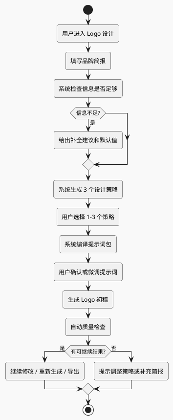

# BloomCanvas Logo 设计体验升级规格

日期：2026-07-09

## 1. 背景

当前 Logo 专题已经能创建项目、填写品牌简报、生成提示词包、按方向生成结果。但实际测试里，用户容易得到模板化、廉价感强的 Logo。典型表现：

- 结果高度趋同，例如大量 `BI + 上升箭头`。
- 图形像图库 Logo，不像经过设计判断的品牌标识。
- 用户可以同时选择多个互相冲突的 Logo 类型，例如“图标 + 品牌名、纯图形、品牌全名文字、首字母、徽章”一起选。
- 提示词虽然有“简单、可缩放、少细节”等负面约束，但缺少正向设计策略。
- 文字 Logo 直接交给图像模型，容易出现中文排版差、小字乱码、字形粗糙。

结论：问题不只是提示词措辞，而是流程还太像“泛化生图表单”。Logo 设计需要更强的产品防呆、默认策略和系统代用户做设计判断。

## 2. 参考原则

公开 Logo brief 和 AI Logo prompt 资料有几个共同点：

- Logo prompt 应像 mini creative brief，需要品牌、受众、气质、色彩、排除项和使用场景，而不是只堆风格词。
- Logo brief 应询问业务、目标用户、市场定位、竞品、品牌关键词和禁忌，而不是让客户自己决定所有设计手法。
- 好 Logo 应简单、合适、容易记住、可缩放，黑白和小尺寸下仍成立。
- AI 生成时要显式避免通用图库感、假文字、复杂细节、阴影、发光、mockup 背景和行业俗套。
- 多轮探索时，每次应控制变量，不要一次改变 Logo 类型、隐喻、颜色、风格和文字结构。

参考资料：

- Renderforest: https://www.renderforest.com/blog/ai-logo-prompts
- Canva: https://www.canva.com/learn/questions-to-ask-when-designing-a-logo/
- Una Healy Design: https://www.unahealydesign.com/logo-design-questionnaire/
- UCDA: https://www.ucda.com/logo-design/
- Design102: https://design102.blog.gov.uk/2023/08/25/what-are-the-top-principles-for-great-logo-design/
- Kitnex: https://www.kitnex.ai/blog/ai-logo-prompts

## 3. 产品目标

Logo 设计专题升级后的目标：

1. 用户少思考术语，多表达品牌。
2. 系统默认防止低质量组合，例如全选 Logo 类型、过多风格、过多元素。
3. 系统在生成图片前先生成设计策略，让用户选方向。
4. 提示词由系统编译成明确、无歧义、模型可执行的设计要求。
5. 生成后自动质检，告诉用户哪些结果不建议继续。

非目标：

- 不做完整 VI 设计系统。
- 不做专业字体排版工具。
- 不承诺一次生成最终商用 Logo。
- 不做竞品 Logo 抄袭或临摹。

## 4. 新流程



### 4.1 品牌简报

用户主要填写：

| 字段 | 规则 | 系统用途 |
| --- | --- | --- |
| 品牌名 | 必填 | 判断是否需要文字、中文、英文、简称 |
| 简称 / 英文名 | 可选 | 适合首字母或缩写方向 |
| 业务一句话 | 必填 | 避免只按行业模板生成 |
| 目标用户 | 建议填写 | 判断专业、亲和、年轻、高端等气质 |
| 品牌关键词 | 2-4 个 | 控制气质，超过 4 个提醒收敛 |
| 不想要什么 | 可选 | 写入负面约束 |
| 主要使用场景 | 1-3 个 | 判断是否优先 App 图标、小尺寸、印刷等 |

系统不要求用户理解“字体标、字母标、组合标”等术语。界面可以用短标签，但必须有悬浮说明。

### 4.2 系统生成设计策略

用户填完品牌简报后，系统先生成策略，不直接生图。

每个策略包含：

| 字段 | 示例 |
| --- | --- |
| 策略名 | 数据推进感 |
| 核心隐喻 | 数据流、路径、轻微冲刺感 |
| Logo 主类型 | 首字母 / 缩写 |
| 视觉结构 | `BI` 字母 + 单一前进路径 |
| 推荐颜色 | 蓝绿双色，最多 2 色 |
| 明确避免 | 普通向上箭头、柱状图、速度线、复杂小字 |
| 适合场景 | 网站、团队头像、内部工具图标 |

策略示例：

```text
方向 A：数据推进感
核心隐喻：数据流 / 前进路径
主类型：首字母 / 缩写
避免：普通向上箭头、柱状图、火箭、速度线

方向 B：可靠 BI 中枢
核心隐喻：仪表盘中心节点 / 决策中枢
主类型：纯图形图标
避免：复杂网络线、齿轮、科技蓝模板

方向 C：团队冲刺旗帜
核心隐喻：旗帜 / 指南针 / 前进路线
主类型：图标 + 品牌名
避免：廉价渐变箭头、小字口号、插画人物
```

## 5. 防呆规则

### 5.1 Logo 类型

Logo 类型从“多选”改为“主类型单选 + 可选辅助版本”。

主类型只能选一个：

- 纯图形图标
- 品牌全名文字
- 首字母 / 缩写
- 图标 + 品牌名
- 徽章 / 印章式

防呆规则：

- 不允许一次全选多个 Logo 类型。
- 如果选择“品牌全名文字”，提示 AI 可能生成不稳定文字，建议先生成图形或首字母方向。
- 如果品牌名包含中文，默认不建议第一轮生成小字号中文组合。
- 如果使用场景包含 App 图标，默认优先“纯图形图标”或“首字母 / 缩写”。
- 如果没有简称，不默认推荐“首字母 / 缩写”。

### 5.2 风格方向

风格方向最多 3 个，默认 2 个。系统推荐，而不是默认全开。

防呆规则：

- 不允许同时选择风格跨度过大的组合，例如“亲和圆润 + 高端克制 + 徽章式 + 科技感”全开。
- 如果用户选择过多方向，提示：“先比较 2-3 个清晰方向，更容易得到可用结果。”
- 每个方向只改变一个主要变量，例如隐喻、结构或气质，不同时改变全部。

### 5.3 颜色

默认最多 2 色。

防呆规则：

- 不默认使用渐变。
- 不默认使用金属、发光、强阴影。
- 必须生成可单色成立的方案。
- 如果用户写“蓝绿组合双色”，系统应明确为 `two solid colors, blue and green, no gradients unless explicitly requested`。

### 5.4 文字

文字是 AI Logo 生成最容易翻车的部分。

防呆规则：

- 默认禁止小字号副标题和 slogan。
- 组合标第一轮可以只要求主品牌名，不要求 slogan。
- 中文品牌名如果要进入 Logo，提示词应要求 `large, legible main brand text only`。
- 对于 App 图标和社媒头像，默认不生成长中文文字。

## 6. 提示词编译规则

新的提示词分两步：

1. `DesignStrategyPrompt`：让文本模型根据品牌简报生成设计策略。
2. `LogoImagePrompt`：把某个策略编译成图像模型可执行的最终提示词。

### 6.1 设计策略提示词

目标是生成 3 个策略，不生成图片。

输出结构：

```json
{
  "strategies": [
    {
      "name": "数据推进感",
      "coreMetaphor": "data flow as a forward path",
      "logoType": "initials or abbreviation logo",
      "visualStructure": "BI letters integrated with one simple forward path",
      "colorPlan": "two solid colors: blue and green",
      "avoid": ["generic upward arrow", "bar chart", "rocket", "tiny slogan"],
      "why": "Fits an ecommerce BI team that wants clarity and forward motion."
    }
  ]
}
```

### 6.2 图像提示词

图像提示词必须使用明确英文，不使用中文设计术语短词。

核心结构：

```text
Create a professional logo mark for [brand].

Brand context:
- ...

Design strategy:
- Core metaphor: ...
- Logo type: initials or abbreviation logo
- Visual structure: ...

Execution rules:
- flat vector logo
- one core idea only
- maximum two main visual elements
- clear silhouette
- solid colors only
- no gradients, no shadows, no 3D, no mockup
- no generic upward arrows, no bar charts, no stock-logo swooshes
- no tiny text, no slogan, no decorative micro-details
- must remain readable at 64px and 32px
- centered on a plain white background
```

必须避免：

- `Logo type: 字体标, 字母标, 组合标`
- `make it modern and creative`
- `high-end, tech, friendly, premium, dynamic` 这类无结构堆词
- 未解释的中文术语

## 7. 自动质量检查

每张结果生成后，系统给出质量标签。首版可以先做规则判断和视觉预览，不需要模型评分。

检查项：

| 检查 | 判定 |
| --- | --- |
| 小尺寸 | 32px / 64px 下是否仍能看清主体 |
| 单色可用 | 黑白背景和灰度版本是否仍成立 |
| 文字风险 | 是否出现小字、错字、乱码、过多文字 |
| 俗套风险 | 是否出现通用箭头、柱状图、火箭、齿轮、网络节点堆叠 |
| 细节风险 | 是否有复杂纹理、细线、阴影、渐变、发光 |
| 构图风险 | 是否主体过小、过满、偏离中心 |

UI 呈现：

- 推荐继续：绿色标签
- 需要谨慎：黄色标签
- 不建议继续：红色标签

## 8. UI 改造

### 8.1 表单

表单从“设计参数面板”变成“品牌简报面板”：

- 术语短标签必须配说明。
- 默认折叠高级项。
- 对容易导致低质结果的选择给出即时提示。
- 生成按钮前增加“生成设计策略”步骤。

### 8.2 策略选择

中间区域在生成图片前展示策略卡片：

- 策略名
- 核心隐喻
- Logo 主类型
- 避免元素
- 推荐理由
- 选择按钮

用户可以选择 1-3 个策略进入生图。

### 8.3 结果区

结果按策略分组，而不仅按风格方向分组。

每张结果卡片展示：

- 原图
- 32px / 64px 小尺寸预览
- 质量标签
- 继续修改
- 重新生成同策略
- 换一个策略

## 9. 成功标准

升级完成后，应满足：

- 用户不需要理解 Logo 设计术语，也能走完流程。
- 用户无法一键选出明显冲突的 Logo 类型组合。
- 生成前能看到系统给出的设计策略。
- 图像提示词里没有模糊中文术语短词。
- 默认 prompt 明确避免通用箭头、柱状图、火箭、齿轮、复杂网络线、stock-logo swooshes。
- 结果有小尺寸和质量风险提示。
- 当前 `BI 向前冲` 这类案例不应默认生成一堆 `BI + 普通上升箭头`。

## 10. 分阶段实现

### 第一阶段：低成本修正

- Logo 类型改为主类型单选。
- 默认只推荐 2 个策略方向。
- 提示词加入行业俗套禁用词。
- 中文术语全部改为明确英文设计要求。
- 保留当前结果分组和项目结构。

### 第二阶段：设计策略层

- 新增 `LogoDesignStrategy` 类型。
- 新增策略生成 IPC。
- UI 增加策略卡片。
- 生图基于策略，而不是直接基于表单风格方向。

### 第三阶段：质量检查

- 增加前端小尺寸、黑白、背景检查。
- 增加规则化质量标签。
- 后续可接入视觉模型做更准确的 Logo 评分。
