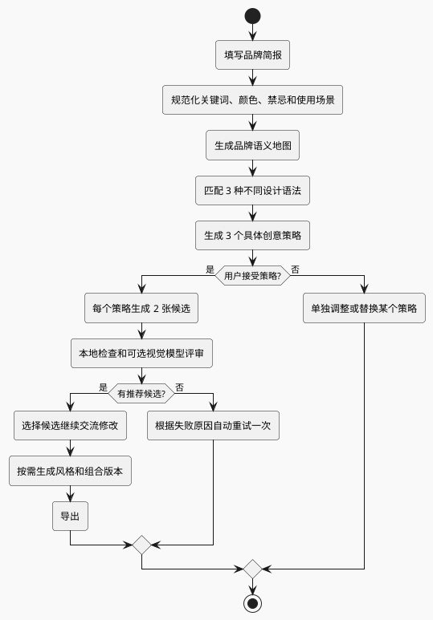
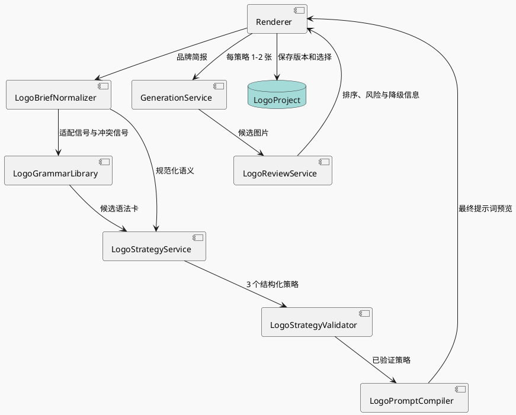

# BloomCanvas Logo 设计 2.0 规格

日期：2026-07-13

## 1. 背景与结论

当前 Logo 专题已经具备品牌简报、项目保存、提示词预览、按风格方向生成和参考图继续修改等基础能力，但实际结果仍然容易模板化。

本机实际案例暴露出两个典型问题：

- “生花”的多个方向都收敛为花瓣、叶片和圆角方框，只改变排列与颜色。
- “BI 向前冲”的多个方向都收敛为 `BI` 字母拼形或企业蓝绿模板，缺少真正不同的品牌构想。

根因不是单纯缺少负面提示词，而是当前系统把“现代极简、图形符号、高端克制”等表现风格当成了创意策略。不同方向复用同一份品牌提示词，只追加一句风格描述，因此图像模型没有得到具体、独特且可执行的构形方案。

Logo 2.0 的核心结论：

1. 品牌简报不能直接编译为图片提示词，必须先经过设计策略层。
2. 设计策略不能只是风格词，必须明确核心隐喻、构形机制、轮廓和禁忌。
3. 优秀案例的价值不是提供可临摹的外观，而是沉淀可复用的设计语法。
4. BloomCanvas 仍然是 AI 生图软件，不承担像素级编辑、专业矢量制版和完整 VI 交付。
5. 产品流程保持轻量，以“简报、策略、生成与筛选、修改与导出”四步为主。

## 2. 产品定位

Logo 2.0 的定位是：

> 帮助没有专业设计流程的用户，把模糊的品牌意图转化为三个清晰、不同、可继续迭代的 Logo 创意方向，并通过 AI 生图提高得到高质量候选的概率。

### 2.1 目标

- 用户主要表达品牌，不需要理解大量 Logo 术语。
- 系统先产生具体设计策略，再产生图片。
- 默认生成三个不同策略，每个策略两个候选，共六张初稿。
- 系统自动降低重复、俗套、细碎、伪文字和方案合集的出现概率。
- 生成失败、评审失败或部分策略失败时，已成功结果仍然可用。
- 用户选中候选后，可以通过参考图生图继续交流修改。
- URL、API Key、提示词模型和图片模型继续支持自定义兼容供应商，不强制官方服务。

### 2.2 非目标

- 不做 Illustrator、Figma 或专业矢量节点编辑器。
- 不承诺一次生成最终可注册、可印刷的商用 Logo。
- 不在首版实现自动矢量描摹和 SVG 路径编辑。
- 不在首版实现完整字体授权库、字距微调和专业制版。
- 不在运行时抓取第三方 Logo 图片作为参考图。
- 不复制具体品牌的图形、字形、比例、配色或布局。

## 3. 研究方法与来源策略

### 3.1 研究方法

第一轮研究使用“广泛目录 + 代表案例深读”的方式：

1. 从专业设计机构的公开品牌识别目录建立候选集。
2. 选择横跨科技、文化、金融、消费、工业和公共服务的案例。
3. 阅读案例中的挑战、策略、身份和应用说明。
4. 只提取构形机制、适用条件、失败风险和评审标准。
5. 不把第三方 Logo 图片、品牌名或专有几何写入生产提示词。

首轮已核验的公开来源：

- Pentagram Brand Identity：<https://www.pentagram.com/brand-identity>
- Koto Work：<https://koto.com/work>
- Design102 Logo 原则：<https://design102.blog.gov.uk/2023/08/25/what-are-the-top-principles-for-great-logo-design/>
- Tubik Logo 设计过程：<https://tubikstudio.com/blog/case-study-tubik-logo/>

Design102 总结的六项原则作为基础质量标准：简单、原创、长期有效、相关、可用、通用。Tubik 的过程案例进一步验证：专业 Logo 设计会先广泛探索不同概念，再依据辨识度、小尺寸可读性和品牌代表性收敛，而不是先选“高端、科技、极简”等风格词。

### 3.2 来源与版权规则

- 研究文档保留来源 URL 和案例名称，便于追溯。
- 软件发行包只包含抽象后的设计语法，不包含案例图片。
- 运行时策略提示词不出现来源品牌名、设计机构名或“仿照某品牌”等描述。
- 设计语法卡只描述通用机制，例如负形、字母融合、连续路径和模块化结构。
- 后续若引入可检索视觉参考库，必须单独解决素材授权、商标近似和结果相似度检查。

## 4. 四步产品流程



### 4.1 品牌简报

核心字段直接展示：

| 字段 | 规则 | 用途 |
| --- | --- | --- |
| 品牌名 | 必填 | 识别语言、字母和直译风险 |
| 英文名 / 简称 | 可选 | 支持字母标和组合标 |
| 业务描述 | 必填 | 提取真实品牌事实，而不是只按行业生成 |
| 目标用户 | 建议填写 | 判断表达强度、亲和度和专业度 |
| 品牌关键词 | 2-4 个 | 建立品牌气质，不直接当构形词使用 |
| 核心差异点 | 建议填写 | 产生与竞品不同的创意来源 |
| 想避免的元素 | 可选 | 形成动态禁忌 |
| 使用场景 | 1-3 个 | 判断小尺寸、横版、包装和门店需求 |

关键词、颜色和禁忌使用标签输入，支持英文逗号、中文逗号、顿号和回车。系统必须把 `绚丽、设计感、创意` 识别为三个值，而不是一个字符串。

### 4.2 创意策略

系统固定生成三个策略。三个策略必须使用不同 `grammarId`，并且至少在“视觉隐喻”和“构形方式”两个维度上不同。

每个策略展示：

- 策略名称和一句话创意。
- 品牌依据，说明为什么适合这个品牌。
- 核心隐喻和构形机制。
- 预期轮廓和视觉重心。
- 推荐表现风格。
- 明确禁用元素。
- 最终英文图片提示词，默认折叠在高级设置中。

用户可以采用、调整或单独替换某个策略，不需要全部重做。

### 4.3 生成与筛选

质量优先模式为默认模式：

- 三个策略。
- 每个策略两个候选。
- 共六张初稿。
- 生成后执行本地检查和可选 AI 视觉评审。

省钱模式：

- 三个策略。
- 每个策略一个候选。
- 可关闭 AI 视觉评审，仅保留本地预览。

每个策略独立生成并立即展示。一个策略失败不能中断其他策略，不能把已成功图片替换成灰色占位。

### 4.4 修改与导出

用户选中候选后进入参考图生图，提供两个修改模式：

- 保持结构：尽量锁定轮廓，只修改颜色、粗细、圆角、比例和表现风格。
- 继续探索：保留核心策略，允许重构局部几何。

“增加品牌文字、生成横版组合、生成 2.5D 版本、查看黑白版本”等作为按需操作，不强制所有 Logo 类型走完相同流程。

## 5. 设计语法库

### 5.1 语法库定位

语法库是版本化的静态领域配置，不是图片素材库。它的作用是给策略模型提供可靠的设计方法和边界。

首版包含 14 张语法卡：

| ID | 中文名 | 核心机制 | 适合 | 主要风险 |
| --- | --- | --- | --- | --- |
| `negative-space-fusion` | 负形融合 | 两个实体形之间形成第三个可识别符号 | 双重含义、连接、隐藏信息 | 内部空隙过小，小尺寸消失 |
| `monogram-synthesis` | 字母融合 | 将 1-3 个首字母合为一个整体轮廓 | 简称明确、专业服务、数字产品 | 字母堆叠、难读、像模板 |
| `semantic-hybrid` | 语义合成 | 两个品牌事实合成一个图形，而非并排两个图标 | 品牌故事清晰、业务有双重属性 | 机械拼贴、元素过多 |
| `continuous-path` | 连续路径 | 一条连续路径形成主体或隐藏字母 | 连接、旅程、创作、流动 | 线条过细、自交过多 |
| `modular-grid` | 模块化网格 | 少量重复模块在清晰网格中构形 | 数据、系统、平台、工具 | 复杂节点图、QR 码直译 |
| `interlocking-units` | 互锁单元 | 2-4 个实体块互锁形成稳定整体 | 协作、生态、整合 | 意外形成花瓣、莲花或普通拼图 |
| `frame-threshold` | 框景与入口 | 开放框、门、窗口或边界定义进入和聚焦 | 画布、平台、空间、选择 | 普通 App 圆角方框、过度封闭 |
| `fold-unfold` | 折叠与展开 | 一个平面由闭合到展开表达变化 | 创意、成长、发布、转型 | 依赖 3D 效果、细节过多 |
| `radial-core` | 放射核心 | 少量单元围绕稳定中心形成能量或共同体 | 社群、聚合、文化 | 花朵、太阳、旋叶俗套 |
| `signal-rhythm` | 信号节奏 | 条、波、脉冲或节拍形成统一符号 | 音频、数据、实时服务 | 普通均衡器、速度线 |
| `custom-wordmark` | 定制字标 | 在完整品牌名中统一修改一到两个结构特征 | 品牌名短、文字识别优先 | 每个字都不同、伪文字、可读性差 |
| `symbol-as-system` | 符号生成系统 | Logo 的几何规则同时生成版式、图案或动效 | 多触点品牌、平台和文化机构 | Logo 与后续应用脱节 |
| `simplified-character` | 简化角色 | 将人物、动物或物件压缩为强轮廓符号 | 有真实角色来源、亲和品牌 | 插画化、五官和细节过多 |
| `dynamic-aperture` | 动态开合 | 稳定母形可开合、缩放或重组 | 媒体、AI、文化、动态产品 | 静态关键帧不成立、变化无边界 |

### 5.2 语法卡结构

```ts
interface LogoGrammarCard {
  id: string
  nameZh: string
  mechanism: string
  fitSignals: string[]
  conflictSignals: string[]
  allowedLogoTypes: LogoType[]
  constructionRules: string[]
  antiPatterns: string[]
  promptFragments: string[]
  reviewRules: string[]
  sourceRefs: string[]
}
```

示例：

```json
{
  "id": "negative-space-fusion",
  "nameZh": "负形融合",
  "mechanism": "Use two bold solid forms so the space between them creates one additional meaningful silhouette.",
  "fitSignals": ["two related brand ideas", "connection", "hidden meaning"],
  "conflictSignals": ["long brand name", "ornate emblem", "many required elements"],
  "allowedLogoTypes": ["symbol-mark", "lettermark", "combination-mark"],
  "constructionRules": [
    "use no more than two foreground forms",
    "make the negative shape readable at 32px",
    "keep all internal gaps broad and intentional"
  ],
  "antiPatterns": [
    "no decorative cutouts",
    "no hidden symbol that requires explanation to notice",
    "no imitation of an existing trademark"
  ],
  "promptFragments": [
    "build one compact mark from two bold solid forms",
    "use the negative space between them to reveal a third simple silhouette"
  ],
  "reviewRules": [
    "the hidden silhouette remains visible in monochrome",
    "the mark still reads when reduced to 32px"
  ],
  "sourceRefs": ["research-conical", "research-mon-takanawa"]
}
```

`sourceRefs` 只用于研究追溯，生产提示词不得包含来源品牌或设计机构。

### 5.3 动态反俗套规则

固定禁词只能解决一部分问题。系统还要根据简报动态生成禁忌：

| 触发条件 | 默认排除 |
| --- | --- |
| 品牌名包含花、生长、绽放 | 不默认直接画花瓣、叶片、莲花；至少两个策略必须使用非植物语法 |
| 数据、BI、分析 | 不默认使用柱状图、上升箭头、仪表盘、网络节点 |
| 安全、保险 | 不默认使用锁、盾牌、钥匙孔和黑色阴影人物 |
| AI、科技 | 不默认使用大脑、电路板、机器人头、发光火花 |
| 物流、全球 | 不默认使用地球、定位针、飞机和速度线 |
| 环保、可持续 | 不默认使用叶片、地球和循环箭头 |

用户明确要求某个元素时可以解除禁用，但策略必须说明为什么使用，以及如何避免普通图库感。

## 6. 策略与提示词架构

### 6.1 数据流



### 6.2 品牌语义地图

简报先被整理为：

```ts
interface LogoBrandSemantics {
  functionalTruths: string[]
  emotionalQualities: string[]
  differentiators: string[]
  audienceSignals: string[]
  usableMetaphors: string[]
  literalMetaphorRisks: string[]
  industryCliches: string[]
  usageConstraints: string[]
}
```

模型不能只根据品牌名猜图形。策略里的每个视觉决定必须至少关联一个 `functionalTruths` 或 `differentiators`。

### 6.3 设计策略结构

```ts
type LogoRenderStyle =
  | 'flat-monochrome'
  | 'flat-duotone'
  | 'restrained-gradient'
  | 'bold-outline'
  | 'soft-2.5d'
  | 'soft-volume'
  | 'embossed'
  | 'skeuomorphic'

interface LogoDesignStrategy {
  id: string
  nameZh: string
  summaryZh: string
  grammarId: string
  brandEvidence: string[]
  coreMetaphor: string
  construction: string
  silhouette: string
  composition: string
  colorPlan: string
  recommendedRenderStyles: LogoRenderStyle[]
  exclusions: string[]
  rationaleZh: string
  imagePromptEn: string
}
```

策略模型输出 JSON，经过 Schema 校验。无效输出只自动修复一次；再次失败则显示明确错误，不静默回退到旧模板。

### 6.4 多样性校验

三个策略必须满足：

- `grammarId` 不同。
- 核心隐喻不能只是同义改写。
- 构形方式不同，例如负形、字母融合、连续线条。
- 不能只改变颜色、圆角或渲染风格。
- 不得三个策略都使用品牌名的字面图形。
- 不得三个策略都使用行业第一联想。

不满足时，策略服务只重写重复策略，不重写已合格策略。

### 6.5 图片提示词结构

图片提示词以正向构形为主，负面规则保持短而明确：

```text
Create exactly one standalone logo mark for the brand described below.

Brand meaning:
- ...

Chosen design strategy:
- Design mechanism: ...
- Core metaphor: ...
- Geometric construction: ...
- Expected silhouette: ...
- Composition: ...
- Color plan: ...

Execution requirements:
- show exactly one isolated mark, not a logo sheet or multiple options
- no brand name, letters, slogan, caption, or pseudo-text in this symbol exploration stage
- one dominant silhouette with no more than two main visual elements
- broad internal gaps and no fragile thin lines
- clean plain background, no mockup, no poster, no scene
- the structure must remain recognizable in monochrome and at 32px

Strategy-specific exclusions:
- ...
```

第一轮图形探索必须明确禁止品牌文字和伪文字。字母标例外，但只能出现策略指定的 1-3 个字母，不能出现完整品牌名或额外文本。

## 7. 表现风格与 Logo 母版

构形与表现风格分离。

### 7.1 母版兼容风格

- 单色扁平。
- 双色扁平。
- 克制渐变。
- 粗线或实体几何。

这些风格可以直接用于首轮探索，但都必须能生成黑白检查版本。

### 7.2 应用版本风格

- 2.5D。
- 软质立体。
- 浮雕或材质化。
- 拟物。

应用版本不能成为唯一母版。用户选择这些风格时，系统仍然保存并展示基础平面结构。如果立体效果掩盖轮廓，则标记为“适合作为应用图标，不适合作为 Logo 母版”。

### 7.3 文字类型处理边界

首版仍然依赖图像模型，因此文字处理必须明确区分 Logo 类型：

- 纯图形图标：第一轮完全禁止文字和伪文字。
- 图标 + 品牌名：第一轮先确定纯图形；第二轮以选中图形为参考图，只增加完整品牌名，不增加 slogan。第二轮属于 AI 组合预览，不承诺专业字距和矢量制版。
- 首字母 / 缩写：第一轮只允许策略指定的 1-3 个拉丁字母，或 1-2 个明确指定的中文主字。多字、错字或额外字符属于硬失败。
- 品牌全名文字：直接进入定制字标策略，不强制先生成图形。系统必须优先保证拼写和可读性；任何错字、漏字或伪字符都标记为硬失败。
- 徽章 / 印章式：第一轮先确认外轮廓和中心符号，环形文字和小字后置。

最终导出要明确标注 AI 文字组合仍是光栅设计草案。确定性字体排版、字体授权和矢量文字组合继续保留在后续范围。

## 8. 自动评审与降级

### 8.1 本地检查

本地检查不假装理解审美，只执行可验证任务：

- 图片成功解码且不是空白图。
- 生成 64px、32px、灰度、纯黑和反白预览。
- 检查整体对比度是否过低。
- 展示不同背景下的实际效果。

本地检查不能可靠判断原创性、品牌相关性、俗套和伪文字，这些属于视觉模型或人工判断。

### 8.2 AI 视觉评审

视觉评审输出结构化结果：

```ts
interface LogoCandidateReview {
  candidateId: string
  status: 'recommended' | 'adjustable' | 'not-recommended'
  reviewMode: 'vision-model' | 'local-only'
  scores: {
    strategyFit: number
    distinctiveness: number
    simplicity: number
    smallSizePotential: number
    craft: number
  }
  hardFailures: string[]
  risksZh: string[]
  suggestedRevisionZh?: string
}
```

硬失败包括：

- 一张图出现多个 Logo 或方案合集。
- 出现未要求的品牌文字、伪文字、说明文字或水印。
- 生成 Mockup、海报、场景或展示板，而不是独立标志。
- 明显违背策略禁忌。
- 细节密度明显无法用于小尺寸。

系统优先展示 `recommended`，折叠 `not-recommended`，但不删除任何结果。

### 8.3 自定义供应商降级

- 策略生成使用用户配置的提示词模型。
- 图片生成使用用户配置的图片模型。
- 视觉评审优先尝试用户配置的提示词模型处理图片输入。
- 如果兼容供应商不支持图片理解，评审自动降级为 `local-only`。
- 降级后明确提示“当前供应商未执行 AI 视觉评审”，不能显示伪造的 AI 分数。
- 评审失败不影响图片生成结果，也不把成功生成记录标记为失败。

首版不强制新增独立视觉模型配置，避免增加供应商设置复杂度。后续可以再增加专门的评审模型。

## 9. 状态、版本与失效规则

当前表单中的 `promptPack` 可能在用户修改品牌简报后继续被复用。Logo 2.0 必须显式管理依赖版本。

```ts
interface LogoDesignRevision {
  briefVersion: number
  strategyVersion: number
  grammarLibraryVersion: number
  strategies: LogoDesignStrategy[]
  selectedStrategyIds: string[]
  createdAt: string
}
```

规则：

- 修改品牌简报后，旧策略和旧提示词标记为过期。
- 过期内容仍可查看，不能静默用于新一轮生成。
- 修改某个策略只使该策略的提示词失效，不影响另外两个策略。
- 修改颜色或表现风格，只重编译图片提示词，不重新生成品牌语义地图。
- 生成记录保存简报、语法卡版本、策略和最终提示词快照。
- 每次参考图修改建立新分支，不覆盖原候选。

## 10. UI 结构

Logo 项目工作区使用四步导航：

| 步骤 | 主要内容 | 主操作 |
| --- | --- | --- |
| 品牌简报 | 核心信息和折叠高级信息 | 生成创意策略 |
| 创意策略 | 三个策略及品牌依据 | 生成 Logo 初稿 |
| 生成与筛选 | 按策略分组的候选和评审 | 选择并继续修改 |
| 修改与导出 | 大图、修改输入、版本历史和按需操作 | 导出 |

交互要求：

- 每一步只有一个清晰主按钮。
- 生成过程按策略显示进度和结果，不让整个软件闪烁或清空。
- 结果卡显示“推荐继续、可以调整、不建议继续”和具体原因。
- “保持结构”使用开关，“表现风格”使用分段选择或带说明的选项。
- Prompt 默认折叠，用户可以展开查看和编辑。
- 用户手工编辑 Prompt 后标记为自定义版本；上游信息变化时提示需要重新确认。
- 纯图形标可以直接进入修改与导出。
- 组合标在图形确认后按需增加品牌文字。
- 字母标和品牌全名文字使用各自策略，不强制先生成图形。

## 11. 错误处理与成本控制

### 11.1 技术失败

- 三个策略独立调用或独立记录状态。
- 单个策略失败后继续生成其他策略。
- 用户可以只重试失败策略。
- 成功候选立即落盘并进入历史。
- 失败记录显示供应商返回的可理解错误，不显示灰色伪结果。

### 11.2 质量失败

- 如果六张图全部被评为 `not-recommended`，根据评审原因自动重试一次。
- 自动重试只修改失败相关约束，不改变品牌简报和核心策略。
- 最多自动重试一次，避免无限消耗 API。
- 用户可以关闭自动重试。

### 11.3 成本模式

- 质量优先：六张候选 + AI 视觉评审，默认。
- 省钱模式：三张候选，可关闭 AI 视觉评审。
- UI 在生成前显示预计候选数量，不估算具体金额，因为自定义供应商价格未知。

## 12. 测试与质量基准

### 12.1 自动化测试

- 语法库通过 Schema 校验，ID 唯一，字段完整。
- 简报输入正确切分逗号、中文逗号、顿号和换行。
- 三个策略使用不同语法卡和不同构形方式。
- 图片提示词包含“只生成一个标志”，并禁止方案合集、Mockup 和伪文字。
- 字母标只允许策略指定字母。
- 组合标第一轮不出现品牌文字，第二轮只允许完整品牌名。
- 品牌全名文字出现错字、漏字或伪字符时标记为硬失败。
- 品牌简报变化后旧策略失效。
- 单个策略失败不阻断其他策略。
- 视觉评审失败时正确降级并保留生成结果。
- 自动质量重试最多执行一次。
- 删除生成历史时仍能正确清理 Logo 项目引用。

### 12.2 固定简报基准

至少保留以下基准项目：

| 基准 | 主要风险 | 预期策略差异 |
| --- | --- | --- |
| 生花 / BloomCanvas | 全部变成花瓣、叶片 | 至少两个策略完全不使用植物元素 |
| BI 向前冲 | 上升箭头、柱状图、企业模板 | 字母融合、决策中枢、连续路径三类机制 |
| AI 安全平台 | 大脑、电路、盾牌、锁 | 阈值、聚焦、预测等非行业第一联想 |
| 儿童科学教育 | 卡通化、细节过多 | 模块、探索路径、简化角色 |
| 精品咖啡品牌 | 咖啡豆、杯子、蒸汽 | 字标、产地结构、仪式感几何 |
| 可持续包装 | 叶片、地球、循环箭头 | 折叠、材料循环结构、负形 |
| 金融支付工具 | 钱币、箭头、信用卡 | 流动、连接、字母构形 |
| 当代艺术馆 | 无意义抽象和过度动态 | 框景、动态开合、定制字标 |

### 12.3 验收标准

- 每个基准生成的三个策略都有不同 `grammarId`。
- 每个策略都能用一句话说明品牌依据和构形方式。
- “生花”不再默认生成三组花瓣方向。
- “BI 向前冲”不再默认生成普通上升箭头或柱状图。
- 六张初稿中，方案合集、Mockup 和未要求文字的出现率显著低于当前版本。
- AI 评审不可用时，界面准确显示降级状态。
- 用户在不查看 Prompt 的情况下能够完成全流程。
- 高级用户仍能查看、编辑和确认最终 Prompt。

## 13. 实现范围

### 13.1 本次实现

- 14 张静态设计语法卡。
- 品牌语义地图和动态反俗套规则。
- 结构化设计策略生成与校验。
- 四步 Logo 工作区。
- 每策略独立生成、部分成功和单独重试。
- 默认六张候选和省钱模式。
- 32px、64px、灰度、纯黑、反白预览。
- 可选 AI 视觉评审与供应商降级。
- 保持结构 / 继续探索两种修改模式。
- 按 Logo 类型路由首轮文字规则，并支持组合标的二次文字预览。
- 简报、策略和 Prompt 的版本失效规则。

### 13.2 后续实现

- 可授权视觉参考库和运行时检索。
- 商标或视觉相似度检查。
- 独立视觉评审模型配置。
- 确定性品牌文字排版和字体授权管理。
- 自动矢量化和 SVG 编辑。
- 完整品牌规范和 VI 交付。

### 13.3 实现检查点

本次范围由一个实现计划覆盖，但分成三个必须独立验收的检查点：

1. 策略核心：设计语法库、简报规范化、品牌语义、策略生成、Schema 校验、多样性校验和 Prompt 编译。
2. 生成工作流：四步 UI、版本失效、每策略独立生成、部分成功、单独重试、质量优先和省钱模式。
3. 评审与修改：本地预览、可选 AI 视觉评审、供应商降级、保持结构 / 继续探索和组合标二次文字预览。

每个检查点完成后都要通过对应单元测试和界面测试。前一检查点不依赖后一检查点才能正确保存数据或展示错误。

## 14. 研究案例附录

下列案例用于研究构形机制和品牌系统，不作为运行时视觉参考，也不进入生产提示词。

### 14.1 Pentagram 样本

1. [Rugiet](https://www.pentagram.com/work/rugiet)
2. [Univers](https://www.pentagram.com/work/univers)
3. [Imperial](https://www.pentagram.com/work/imperial)
4. [Dataland](https://www.pentagram.com/work/dataland)
5. [Windham-Campbell Prizes 2025](https://www.pentagram.com/work/windham-campbell-prizes-2025)
6. [Mozilla Foundation](https://www.pentagram.com/work/mozilla-foundation)
7. [Hiut](https://www.pentagram.com/work/hiut)
8. [MedExpress](https://www.pentagram.com/work/medexpress)
9. [Green-Wood Cemetery](https://www.pentagram.com/work/green-wood-cemetery)
10. [St Paul's Cathedral](https://www.pentagram.com/work/st-paul-s-cathedral)
11. [Mosaic Rooms](https://www.pentagram.com/work/mosaic-rooms)
12. [Washington Square Park Conservancy](https://www.pentagram.com/work/washington-square-park-conservancy)
13. [CONICAL](https://www.pentagram.com/work/conical)
14. [MoN Takanawa](https://www.pentagram.com/work/mon-takanawa-the-museum-of-narratives)
15. [SC](https://www.pentagram.com/work/sc)
16. [Folger Shakespeare Library](https://www.pentagram.com/work/folger-shakespeare-library)
17. [London Design Festival 2025](https://www.pentagram.com/work/london-design-festival-2025)
18. [Payz](https://www.pentagram.com/work/payz)
19. [Museo Casa Kahlo](https://www.pentagram.com/work/museo-casa-kahlo)
20. [Power Grid Components / PGC](https://www.pentagram.com/work/power-grid-components-pgc)

### 14.2 Koto 样本

1. [Uniqode](https://koto.com/projects/uniqode)
2. [Microsoft Security](https://koto.com/projects/microsoft-security)
3. [Faculty](https://koto.com/projects/faculty)
4. [Coda](https://koto.com/projects/coda)
5. [Deezer](https://koto.com/projects/deezer)
6. [Stack Overflow](https://koto.com/projects/stack-overflow)
7. [Mews](https://koto.com/projects/mews)
8. [Lyft](https://koto.com/projects/lyft)
9. [Amazon](https://koto.com/projects/amazon)
10. [Microsoft 50th](https://koto.com/projects/microsoft-50th)
11. [The Norton Museum of Art](https://koto.com/projects/the-norton-museum-of-art)
12. [Yazio](https://koto.com/projects/yazio)
13. [MachineX](https://koto.com/projects/machinex)
14. [Tripadvisor](https://koto.com/projects/tripadvisor)
15. [GoFundMe](https://koto.com/projects/gofundme)
16. [Workday](https://koto.com/projects/workday)
17. [Fluz](https://koto.com/projects/fluz)
18. [Bolt](https://koto.com/projects/bolt)
19. [Pairpoint](https://koto.com/projects/pairpoint)
20. [MassiveMusic](https://koto.com/projects/massivemusic)

## 15. 研究结论对产品的直接影响

代表案例反复出现同一条链路：

`单一品牌命题 -> 一个构形机制 -> Logo -> 版式 / 图案 / 动效的一致延展`

例如：

- CONICAL 将字母 `C` 与指南针合为一个图形，而不是把集装箱、船和地球并排堆叠。
- MoN Takanawa 用螺旋同时隐藏 `M/O/N`，并让同一螺旋成为整个版式系统。
- Uniqode 先定义“现实与数字之间的连接”，再用点和线的缝合逻辑统一字体、图案和图标。
- Coda 用一个核心 `C` 作为增长概念和后续版式的重心。
- Deezer 从“音乐活起来”推导心跳符号，再把节拍扩展为动态视觉系统。
- Faculty 用“从前沿到一线”推导阈值图形，避免 AI 行业常见的大脑和电路图。
- Microsoft Security 明确排除锁和阴影人物，先建立“超越表面”的品牌命题。

因此，BloomCanvas 的提示词优化重点不是增加更多形容词，而是让系统为每个策略找到一个可解释的品牌命题和一个可执行的构形机制，并使用相同机制评审结果是否跑偏。
